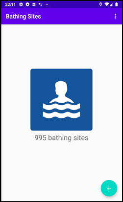
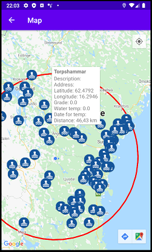
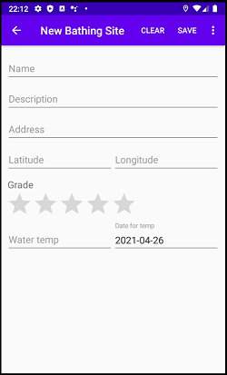
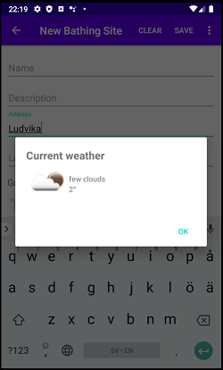
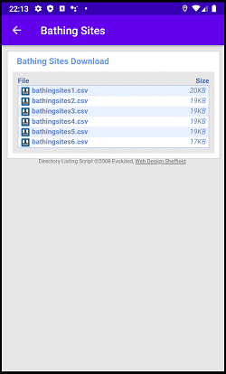

# Bathing Sites

An app for managing bathing places. You can add new bathing places where this data is saved to a database:

- The name of the bathing place.
- A description of the bathing place.
- An address to the bathing place.
- Coordinate (longitude and latitude) to the bathing place.
- The users grade for the bathing place.
- What temperature the water has.
- What date the water temperature was measured.

There is an activity to show the current weather in the bathing area. It is possible to download files with finished bathing places. On a map, bathing areas are located near the user's position

##### Run the project

- Android version 9
- Pixel 2 virtual device
- Add API key to google_maps_api.xml for google maps functionality

